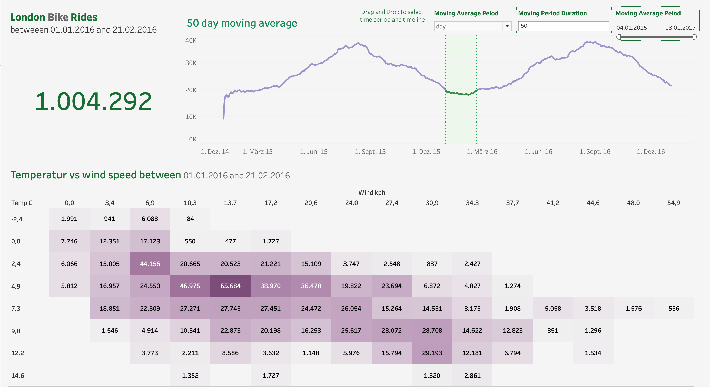

# London Bike-Sharing Analyse

## Überblick
Dieses Projekt analysiert die Nutzungsmuster des Londoner Bike-Sharing-Systems mittels Python und Tableau. Es zeigt die Zusammenhänge zwischen Wetterbedingungen, Tageszeiten und Fahrradnutzung.

## Dashboard


## Funktionen
- Interaktives Tableau-Dashboard
- Wetter- und Nutzungsanalyse
- Stündliche und saisonale Muster
- Anpassbare Zeitreihenanalyse

## Projektstruktur
```
/
├── notebooks/          # Jupyter Notebooks zur Datenverarbeitung
│   └── london-bikes.ipynb
├── data/              # Rohdaten und verarbeitete Daten
│   ├── london_merged.csv
│   └── london-bikes-final-data.xlsx
├── docs/              # Zusätzliche Dokumentation
└── images/            # Dashboard Screenshots
    └── london-bike-sharing-analyse.png
```

## Installation & Nutzung
1. Repository klonen
2. Python-Pakete installieren:
   ```bash
   pip install pandas kaggle openpyxl jupyter
   ```
3. Jupyter Notebook ausführen
4. Optional: Eigene Tableau-Visualisierungen erstellen

## Datenaufbereitung (notebooks/london-bikes.ipynb)
1. Datenimport von Kaggle
2. Bereinigung und Transformation
3. Feature Engineering (Wetter, Jahreszeiten)
4. Export für Tableau

## Dashboard-Funktionen

### Übersicht
- Gesamtanzahl der Fahrten im ausgewählten Zeitraum
- Interaktive Zeitreihenanalyse mit gleitendem Durchschnitt
- Anpassbare Zeitfenster (Tag/Woche/Monat)

### Detailanalysen
- Temperatur/Wind-Heatmap für optimale Fahrbedingungen
- Wettereinfluss auf Nutzungshäufigkeit
- Stündliche Nutzungsmuster und Spitzenzeiten

## Technologien
- Python 3.12
- Pandas
- Kaggle API
- Optional: Tableau 2024.1

## Datenquelle
London Bike Sharing Dataset (Kaggle)

## Lizenz
Dieses Projekt steht unter der MIT-Lizenz - siehe [LICENSE](LICENSE)